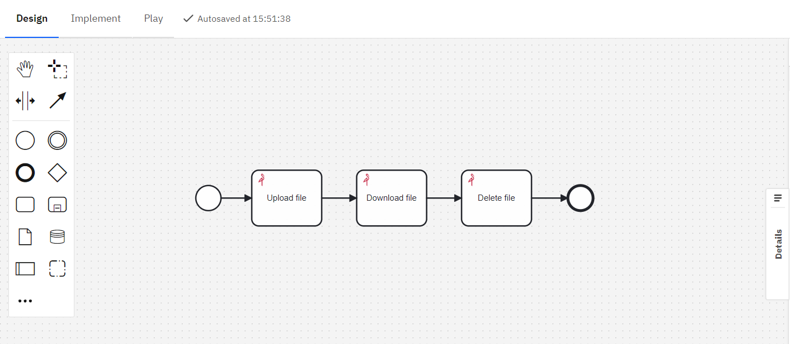
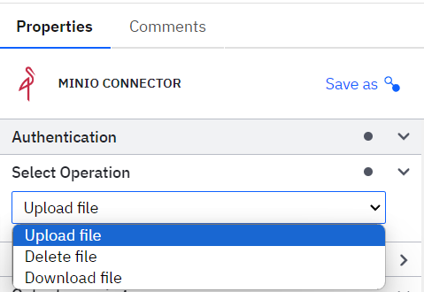
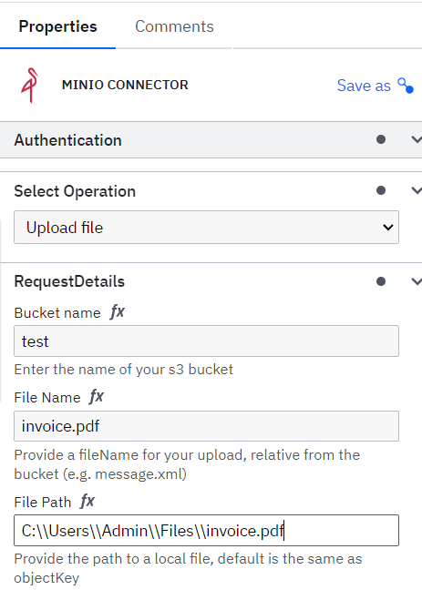
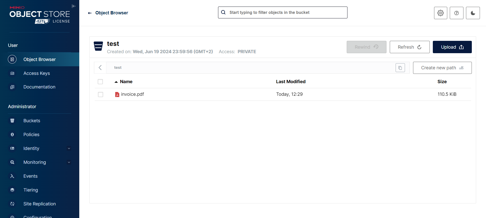
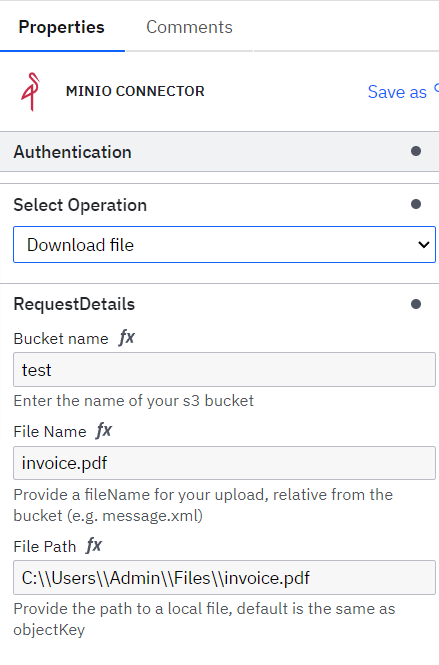
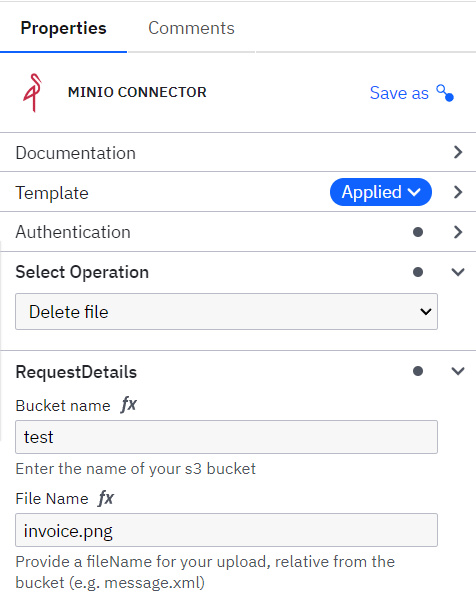

# MinIO connector
MinIO is a high-performance, S3 compatible object store. It is built for
large scale AI/ML, data lake and database workloads. It is software-defined
and runs on any cloud or on-premises infrastructure. It allows you to store and manage large amounts of data, such as files, images, videos, and other types of data as objects. 
MinIO is used to store, process and manage large amounts of data in a convenient and scalable form.
To start using the Connector, you must have a running  MinIO. Refer to the official documentation page https://min.io/  to learn more about how to install and configure the MinIO.

## Authentication​

The process of verifying the identity of a connecting client. MinIO requires clients authenticate using AWS Signature Version 4 protocol with support for the deprecated Signature Version 2 protocol. Specifically, clients must present a valid access key and secret key to access MinIO administrative API.

## Create a  MinIO Connector task​

To use a MinIO Connector in your process, either change the type of existing task using the wrench-shaped Change type context menu, or create a new Connector task using the Append Connector context menu. Follow Camunda guide on using Connectors to learn more.
In the properties block “Authentication” set url, Access Key and Secret Key to MinIO.
All these parameters are mandatory. 
![Authentication!(./assets/images/Authentication.png)

In the section “Output mapping” return data depending on the type of process performed by the robot, that can then be used as variables in the Camunda process.

## Example

The MinIO  Connector supports next operation types in the operation type dropdown list:
1. Upload file
2. Download file
3. Delete file

Operation type:

## Upload file
This operation allows you to upload files from your local system or servers to your MinIO bucket directly through Camunda processes, simplifying data management. 
Usage:
1. Populate the  Authentication section as previously described.
2. Select “Upload file” from the Operation dropdown.
3. In the Request Details section, set the Bucket name of your bucket, provide a file name with extension for your upload and the path to a local file.

As a result of this operation, Camunda upload a file of the process running in a bucket MinIO.

## Download file
This operation allows downloading objects from your MinIO bucket to your local system or server, providing straightforward access for further processing. 
Usage:
1. Populate the  Authentication section as previously described.
2. Select “Download file” from the Operation dropdown.
3. In the Request Details section, set the Bucket name of your bucket, provide a file name with extension for your upload and the path to save the file.

As a result of this operation, the system saves the file.

## Delete file

This operation is used to delete files that are present in a MinIO bucket. 
1. Populate the  Authentication section as previously described.
2. Select “Download file” from the Operation dropdown.
3. In the Request Details section, set the Bucket name of your bucket, provide a file name with extension for deleting.

